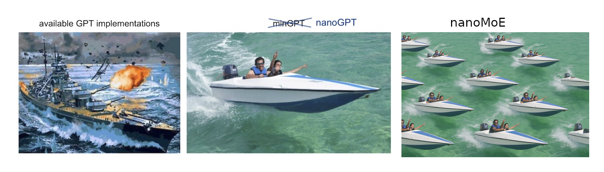

# nanoMoE
Adding support for Mixture of Experts (MoE) models. 
For now, this implementation is based on [OLMoE](https://arxiv.org/pdf/2409.02060). 


## Goals
- [ ] Train an MoE nanoGPT on shakespeare_char
    - [ ] Val loss < 1.467 for ~10M active parameters
    - [ ] Val loss ~= 1.467 for <10M active parameters
- [ ] Must not use [for loops over the experts](https://github.com/huggingface/transformers/blob/6017f5e8ed33d48096cdf8630d1cc7cbf2550c90/src/transformers/models/olmoe/modeling_olmoe.py#L598C1-L598C51)
    - [ ] Triton kernel version
    - [ ] Megablocks version?
- [ ] Train GPT-2 Size MoE on OWT/Fineweb (Stretch Goal if feeling frisky, probably would have to be ~125m *total*, would have to see how efficient we can really get to do ~125m active!)

## Architecture Decisions

### Routing Strategy
- **Router Type**: Top-k routing 
- **Router Architecture**: Single linear layer per MoE block
- **Normalization**: Layer norm before router (following OLMoE's approach)
- **Auxiliary losses**: 
  - Load balancing loss (coefficient ~0.01)
  - Router z-loss for stability (coefficient ~0.001)

### Expert Configuration
We'll do some ablations at the small scale to see what works well. 
- **Expert granularity**: Replace FFN layers with MoE blocks
- **Expert capacity**: Starting with 8 experts per layer, OLMoE uses 64.
- **Active experts**: OLMoE uses 8, maybe start with 2?
- **Expert architecture**: Standard FFN (up projection → activation → down projection)

### Efficient Batching Strategy
- **Grouped dispatch**: Batch tokens by selected experts to avoid loops
- **Capacity factor**: 1.25x to handle load imbalance
- **Dropout**: Expert dropout during training (drop entire experts with p=0.1)

## Ablation Studies (Controlling for Active Parameters)

### 10M Active Parameter Studies
| Config Name | Total Params | Active Params | Multiplier | Experts | Top-k | Notes |
|-------------|--------------|---------------|------------|---------|-------|--------|
| Dense-10M   | 10M          | 10M           | 1x         | 1       | 1     | Baseline |
| MoE-4x2     | 20M          | 10M           | 2x         | 4       | 2     | |
| MoE-8x2     | 40M          | 10M           | 4x         | 8       | 2     | OLMoE multiplier|
| MoE-16x1    | 80M          | 10M           | 8x         | 16      | 2     | |

### 50M Active Parameter Studies
| Config Name | Total Params | Active Params | Multiplier | Experts | Top-k | Notes |
|-------------|--------------|---------------|------------|---------|-------|--------|
| Dense-50M   | 50M          | 50M           | 1x         | 1       | 1     | Baseline |
| MoE-4x2     | 100M         | 50M           | 2x         | 4       | 2     | |
| MoE-8x2     | 200M         | 50M           | 4x         | 8       | 2     | |
| MoE-8x4     | 200M         | 50M           | 4x         | 8       | 4     | Higher k |
| MoE-16x2    | 400M         | 50M           | 8x         | 16      | 2     | |
| MoE-32x1    | 800M         | 50M           | 16x        | 32      | 2     | Extreme sparsity |

## TODO

### Implementation
- [ ] Implement basic MoE layer with top-k routing
- [ ] Add auxiliary losses (load balancing + router z-loss)
- [ ] Implement expert capacity limits and overflow handling
- [ ] Add grouped token dispatch (no loops!)
- [ ] Implement expert dropout
- [ ] Add router temperature scaling
- [ ] Implement different routing strategies (could compare top-k vs expert choice)

### Triton Implementation
    #### Core Data Structures
    - [ ] **Define BCSR format storage** - You'll need arrays for block data, column indices, row indices, and row offsets to efficiently store your sparse matrices
    - [ ] **Set up block size constants** - Start with 128×128 blocks as the research shows this is optimal for GPU utilization

    #### Token Routing & Permutation
    - [ ] **Implement token-to-expert sorting** - Sort tokens by their assigned experts so all tokens for expert 0 come first, then expert 1, etc.
    - [ ] **Add padding logic** - Pad each expert's token group to the nearest block boundary (e.g., if expert has 150 tokens, pad to 256)
    - [ ] **Create permutation tracking** - Keep track of original token positions so you can unpermute the outputs later

    #### SDD Kernel (Sparse = Dense × Dense)
    - [ ] **Set up the kernel signature** - This takes your permuted tokens and first layer expert weights as dense matrices
    - [ ] **Implement block iteration** - Loop through each non-zero block in your sparse output based on the topology
    - [ ] **Add the core matmul** - Use Triton's `tl.dot` for the actual block matrix multiplication, accumulating results

    #### DSD Kernel (Dense = Sparse × Dense)  
    - [ ] **Create 2D grid structure** - Unlike SDD, this needs a 2D grid to handle the dense output efficiently
    - [ ] **Implement row-wise iteration** - For each output row, iterate through all sparse blocks in that row
    - [ ] **Handle output accumulation** - Sum contributions from each sparse block to produce the final dense output

    #### Dynamic Topology Creation
    - [ ] **Count tokens per expert** - Use the routing assignments to determine how many blocks each expert needs
    - [ ] **Build sparse indices** - Generate the row/column index arrays that define which blocks are non-zero
    - [ ] **Handle variable sizes** - Ensure your topology can adapt to different expert loads dynamically

    #### Integration Points
    - [ ] **Replace your loop-based implementation** - Swap out the for-loop over experts with calls to your SDD/DSD kernels
    - [ ] **Add autotuning configs** - Set up Triton autotuning with different block sizes and stage counts
    - [ ] **Implement fallback handling** - Have a plan for edge cases like empty experts or very small batch sizes

    #### Testing & Validation
    - [ ] **Unit test each kernel** - Verify SDD and DSD produce correct results compared to naive implementation
    - [ ] **Profile memory usage** - Ensure you're actually saving memory compared to dense computation
    - [ ] **Benchmark throughput** - Measure FLOPS and compare to your baseline implementation

    Start with the SDD kernel since it's conceptually simpler (you control where outputs go), then tackle DSD once you're comfortable with the block-sparse concepts.

### Optimization
- [ ] Profile memory usage vs dense model
- [ ] Implement gradient checkpointing for MoE layers
- [ ] Add mixed precision support
- [ ] Benchmark routing overhead
- [ ] Compare communication patterns for different expert layouts

### Validation
- [ ] Track per-expert utilization
- [ ] Monitor routing entropy
- [ ] Visualize routing patterns over training
- [ ] Compare active parameters vs total parameters
- [ ] Ablation: number of experts vs performance

### Scaling Tests
- [ ] Start with 2 experts, scale to 8
- [ ] Test different k values (1, 2, 4)
- [ ] Compare dense vs MoE at same active parameters
- [ ] Test on different sequence lengths

# nanoGPT


The simplest, fastest repository for training/finetuning medium-sized GPTs. It is a rewrite of [minGPT](https://github.com/karpathy/minGPT) that prioritizes teeth over education. Still under active development, but currently the file `train.py` reproduces GPT-2 (124M) on OpenWebText, running on a single 8XA100 40GB node in about 4 days of training. The code itself is plain and readable: `train.py` is a ~300-line boilerplate training loop and `model.py` a ~300-line GPT model definition, which can optionally load the GPT-2 weights from OpenAI. That's it.


Because the code is so simple, it is very easy to hack to your needs, train new models from scratch, or finetune pretrained checkpoints (e.g. biggest one currently available as a starting point would be the GPT-2 1.3B model from OpenAI).

## install

```
pip install torch numpy transformers datasets tiktoken wandb tqdm
```

Dependencies:

- [pytorch](https://pytorch.org) <3
- [numpy](https://numpy.org/install/) <3
-  `transformers` for huggingface transformers <3 (to load GPT-2 checkpoints)
-  `datasets` for huggingface datasets <3 (if you want to download + preprocess OpenWebText)
-  `tiktoken` for OpenAI's fast BPE code <3
-  `wandb` for optional logging <3
-  `tqdm` for progress bars <3

## quick start

If you are not a deep learning professional and you just want to feel the magic and get your feet wet, the fastest way to get started is to train a character-level GPT on the works of Shakespeare. First, we download it as a single (1MB) file and turn it from raw text into one large stream of integers:

```sh
python data/shakespeare_char/prepare.py
```

This creates a `train.bin` and `val.bin` in that data directory. Now it is time to train your GPT. The size of it very much depends on the computational resources of your system:

**I have a GPU**. Great, we can quickly train a baby GPT with the settings provided in the [config/train_shakespeare_char.py](config/train_shakespeare_char.py) config file:

```sh
python train.py config/train_shakespeare_char.py
```

If you peek inside it, you'll see that we're training a GPT with a context size of up to 256 characters, 384 feature channels, and it is a 6-layer Transformer with 6 heads in each layer. On one A100 GPU this training run takes about 3 minutes and the best validation loss is 1.4697. Based on the configuration, the model checkpoints are being written into the `--out_dir` directory `out-shakespeare-char`. So once the training finishes we can sample from the best model by pointing the sampling script at this directory:

```sh
python sample.py --out_dir=out-shakespeare-char
```

This generates a few samples, for example:

```
ANGELO:
And cowards it be strawn to my bed,
And thrust the gates of my threats,
Because he that ale away, and hang'd
An one with him.

DUKE VINCENTIO:
I thank your eyes against it.

DUKE VINCENTIO:
Then will answer him to save the malm:
And what have you tyrannous shall do this?

DUKE VINCENTIO:
If you have done evils of all disposition
To end his power, the day of thrust for a common men
That I leave, to fight with over-liking
Hasting in a roseman.
```

lol  `¯\_(ツ)_/¯`. Not bad for a character-level model after 3 minutes of training on a GPU. Better results are quite likely obtainable by instead finetuning a pretrained GPT-2 model on this dataset (see finetuning section later).

**I only have a macbook** (or other cheap computer). No worries, we can still train a GPT but we want to dial things down a notch. I recommend getting the bleeding edge PyTorch nightly ([select it here](https://pytorch.org/get-started/locally/) when installing) as it is currently quite likely to make your code more efficient. But even without it, a simple train run could look as follows:

```sh
python train.py config/train_shakespeare_char.py --device=cpu --compile=False --eval_iters=20 --log_interval=1 --block_size=64 --batch_size=12 --n_layer=4 --n_head=4 --n_embd=128 --max_iters=2000 --lr_decay_iters=2000 --dropout=0.0
```

Here, since we are running on CPU instead of GPU we must set both `--device=cpu` and also turn off PyTorch 2.0 compile with `--compile=False`. Then when we evaluate we get a bit more noisy but faster estimate (`--eval_iters=20`, down from 200), our context size is only 64 characters instead of 256, and the batch size only 12 examples per iteration, not 64. We'll also use a much smaller Transformer (4 layers, 4 heads, 128 embedding size), and decrease the number of iterations to 2000 (and correspondingly usually decay the learning rate to around max_iters with `--lr_decay_iters`). Because our network is so small we also ease down on regularization (`--dropout=0.0`). This still runs in about ~3 minutes, but gets us a loss of only 1.88 and therefore also worse samples, but it's still good fun:

```sh
python sample.py --out_dir=out-shakespeare-char --device=cpu
```
Generates samples like this:

```
GLEORKEN VINGHARD III:
Whell's the couse, the came light gacks,
And the for mought you in Aut fries the not high shee
bot thou the sought bechive in that to doth groan you,
No relving thee post mose the wear
```

Not bad for ~3 minutes on a CPU, for a hint of the right character gestalt. If you're willing to wait longer, feel free to tune the hyperparameters, increase the size of the network, the context length (`--block_size`), the length of training, etc.

Finally, on Apple Silicon Macbooks and with a recent PyTorch version make sure to add `--device=mps` (short for "Metal Performance Shaders"); PyTorch then uses the on-chip GPU that can *significantly* accelerate training (2-3X) and allow you to use larger networks. See [Issue 28](https://github.com/karpathy/nanoGPT/issues/28) for more.

## reproducing GPT-2

A more serious deep learning professional may be more interested in reproducing GPT-2 results. So here we go - we first tokenize the dataset, in this case the [OpenWebText](https://openwebtext2.readthedocs.io/en/latest/), an open reproduction of OpenAI's (private) WebText:

```sh
python data/openwebtext/prepare.py
```

This downloads and tokenizes the [OpenWebText](https://huggingface.co/datasets/openwebtext) dataset. It will create a `train.bin` and `val.bin` which holds the GPT2 BPE token ids in one sequence, stored as raw uint16 bytes. Then we're ready to kick off training. To reproduce GPT-2 (124M) you'll want at least an 8X A100 40GB node and run:

```sh
torchrun --standalone --nproc_per_node=8 train.py config/train_gpt2.py
```

This will run for about 4 days using PyTorch Distributed Data Parallel (DDP) and go down to loss of ~2.85. Now, a GPT-2 model just evaluated on OWT gets a val loss of about 3.11, but if you finetune it it will come down to ~2.85 territory (due to an apparent domain gap), making the two models ~match.

If you're in a cluster environment and you are blessed with multiple GPU nodes you can make GPU go brrrr e.g. across 2 nodes like:

```sh
# Run on the first (master) node with example IP 123.456.123.456:
torchrun --nproc_per_node=8 --nnodes=2 --node_rank=0 --master_addr=123.456.123.456 --master_port=1234 train.py
# Run on the worker node:
torchrun --nproc_per_node=8 --nnodes=2 --node_rank=1 --master_addr=123.456.123.456 --master_port=1234 train.py
```

It is a good idea to benchmark your interconnect (e.g. iperf3). In particular, if you don't have Infiniband then also prepend `NCCL_IB_DISABLE=1` to the above launches. Your multinode training will work, but most likely _crawl_. By default checkpoints are periodically written to the `--out_dir`. We can sample from the model by simply `python sample.py`.

Finally, to train on a single GPU simply run the `python train.py` script. Have a look at all of its args, the script tries to be very readable, hackable and transparent. You'll most likely want to tune a number of those variables depending on your needs.

## baselines

OpenAI GPT-2 checkpoints allow us to get some baselines in place for openwebtext. We can get the numbers as follows:

```sh
$ python train.py config/eval_gpt2.py
$ python train.py config/eval_gpt2_medium.py
$ python train.py config/eval_gpt2_large.py
$ python train.py config/eval_gpt2_xl.py
```

and observe the following losses on train and val:

| model | params | train loss | val loss |
| ------| ------ | ---------- | -------- |
| gpt2 | 124M         | 3.11  | 3.12     |
| gpt2-medium | 350M  | 2.85  | 2.84     |
| gpt2-large | 774M   | 2.66  | 2.67     |
| gpt2-xl | 1558M     | 2.56  | 2.54     |

However, we have to note that GPT-2 was trained on (closed, never released) WebText, while OpenWebText is just a best-effort open reproduction of this dataset. This means there is a dataset domain gap. Indeed, taking the GPT-2 (124M) checkpoint and finetuning on OWT directly for a while reaches loss down to ~2.85. This then becomes the more appropriate baseline w.r.t. reproduction.

## finetuning

Finetuning is no different than training, we just make sure to initialize from a pretrained model and train with a smaller learning rate. For an example of how to finetune a GPT on new text go to `data/shakespeare` and run `prepare.py` to download the tiny shakespeare dataset and render it into a `train.bin` and `val.bin`, using the OpenAI BPE tokenizer from GPT-2. Unlike OpenWebText this will run in seconds. Finetuning can take very little time, e.g. on a single GPU just a few minutes. Run an example finetuning like:

```sh
python train.py config/finetune_shakespeare.py
```

This will load the config parameter overrides in `config/finetune_shakespeare.py` (I didn't tune them much though). Basically, we initialize from a GPT2 checkpoint with `init_from` and train as normal, except shorter and with a small learning rate. If you're running out of memory try decreasing the model size (they are `{'gpt2', 'gpt2-medium', 'gpt2-large', 'gpt2-xl'}`) or possibly decreasing the `block_size` (context length). The best checkpoint (lowest validation loss) will be in the `out_dir` directory, e.g. in `out-shakespeare` by default, per the config file. You can then run the code in `sample.py --out_dir=out-shakespeare`:

```
THEODORE:
Thou shalt sell me to the highest bidder: if I die,
I sell thee to the first; if I go mad,
I sell thee to the second; if I
lie, I sell thee to the third; if I slay,
I sell thee to the fourth: so buy or sell,
I tell thee again, thou shalt not sell my
possession.

JULIET:
And if thou steal, thou shalt not sell thyself.

THEODORE:
I do not steal; I sell the stolen goods.

THEODORE:
Thou know'st not what thou sell'st; thou, a woman,
Thou art ever a victim, a thing of no worth:
Thou hast no right, no right, but to be sold.
```

Whoa there, GPT, entering some dark place over there. I didn't really tune the hyperparameters in the config too much, feel free to try!

## sampling / inference

Use the script `sample.py` to sample either from pre-trained GPT-2 models released by OpenAI, or from a model you trained yourself. For example, here is a way to sample from the largest available `gpt2-xl` model:

```sh
python sample.py \
    --init_from=gpt2-xl \
    --start="What is the answer to life, the universe, and everything?" \
    --num_samples=5 --max_new_tokens=100
```

If you'd like to sample from a model you trained, use the `--out_dir` to point the code appropriately. You can also prompt the model with some text from a file, e.g. ```python sample.py --start=FILE:prompt.txt```.

## efficiency notes

For simple model benchmarking and profiling, `bench.py` might be useful. It's identical to what happens in the meat of the training loop of `train.py`, but omits much of the other complexities.

Note that the code by default uses [PyTorch 2.0](https://pytorch.org/get-started/pytorch-2.0/). At the time of writing (Dec 29, 2022) this makes `torch.compile()` available in the nightly release. The improvement from the one line of code is noticeable, e.g. cutting down iteration time from ~250ms / iter to 135ms / iter. Nice work PyTorch team!

## todos

- Investigate and add FSDP instead of DDP
- Eval zero-shot perplexities on standard evals (e.g. LAMBADA? HELM? etc.)
- Finetune the finetuning script, I think the hyperparams are not great
- Schedule for linear batch size increase during training
- Incorporate other embeddings (rotary, alibi)
- Separate out the optim buffers from model params in checkpoints I think
- Additional logging around network health (e.g. gradient clip events, magnitudes)
- Few more investigations around better init etc.

## troubleshooting

Note that by default this repo uses PyTorch 2.0 (i.e. `torch.compile`). This is fairly new and experimental, and not yet available on all platforms (e.g. Windows). If you're running into related error messages try to disable this by adding `--compile=False` flag. This will slow down the code but at least it will run.

For some context on this repository, GPT, and language modeling it might be helpful to watch my [Zero To Hero series](https://karpathy.ai/zero-to-hero.html). Specifically, the [GPT video](https://www.youtube.com/watch?v=kCc8FmEb1nY) is popular if you have some prior language modeling context.

For more questions/discussions feel free to stop by **#nanoGPT** on Discord:

[](https://discord.gg/3zy8kqD9Cp)

## acknowledgements

All nanoGPT experiments are powered by GPUs on [Lambda labs](https://lambdalabs.com), my favorite Cloud GPU provider. Thank you Lambda labs for sponsoring nanoGPT!
